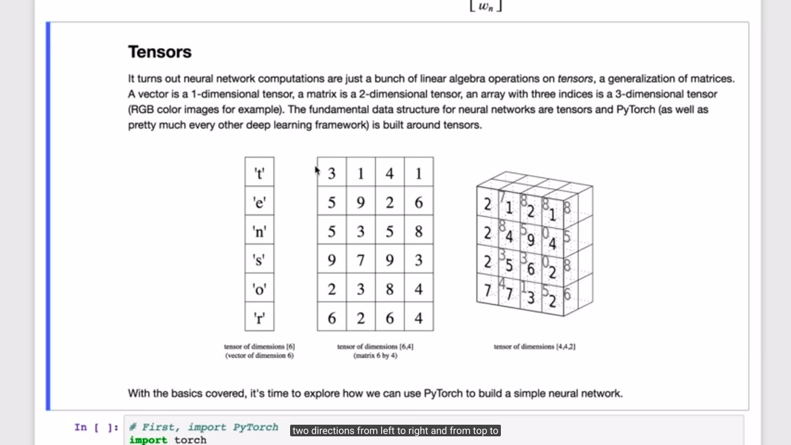

## Day 5 / 30

## Day 5: October 27, 2019
- I started Lesson 7: Deep learning with Pytorch.

Vectors are instance of a tensor.

[Tensors]https://machinelearningmastery.com/introduction-to-tensors-for-machine-learning/) are basic data structure that you use in deep learning frameworks. 

	- A tensor with one dimension is a vector.

	- A 2 dimensional tensor has its value spaning from left to right and up to down

	- A 3 dimensional tensor example is an RGB color image

Features are input data for your network.

